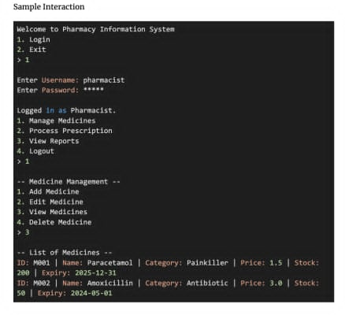

# Pharmacy Information System

## Core Functionalities:

1. User Management

* Pharmacist
* Assistant
* Simple role-based login system

2. Medicine Management

* Add, edit, delete, and search for medicines
* Maintain medicine details:
    - Medicine ID
    - Name
    - Category (e.g. Antibiotics, Painkillers, Vitamins)
    - Price
    - Stock Quantity
    - Expiry date
    - Manufacturer
* Check for expired medicines, and generate alerts.

3. Prescription Processing

* Record and validate prescriptions:
    - Patiend name
    - Prescribed medicines (linked to medicine stock)
    - Dosage and quantity
* Check availability of prescribed medicines
* Deduct the quantity sold from Inventory

4. Customer Management

* Store basic customer details:
    - Customer ID
    - Name
    - Contact Information
    - Purchase history

5. Inventory Management

* Display current stock of medicines
* Alert for low-stock medicines (threshold defined in the system)
* Automatically update stock after sales or restocking

## Sample Interaction

## Sample users

- Pharmacist
    - username: pharmacist
    - password: 1234
- Assistant
    - username: assistant
    - password: 1234
